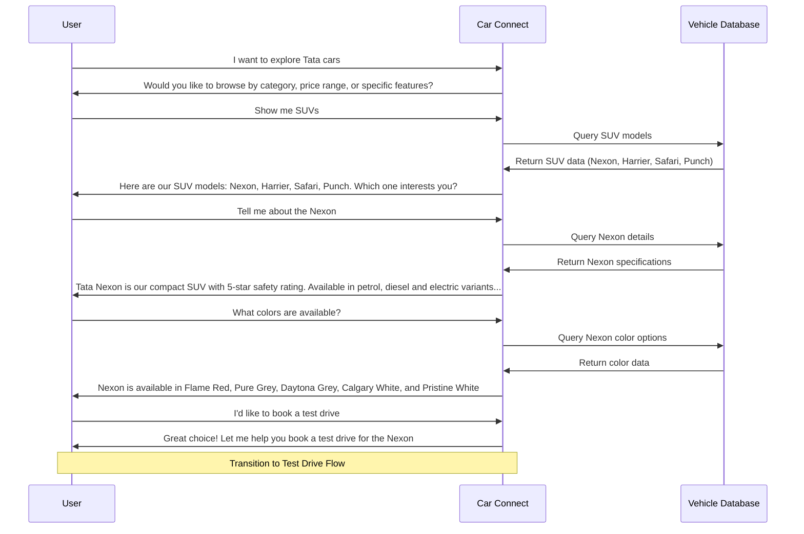
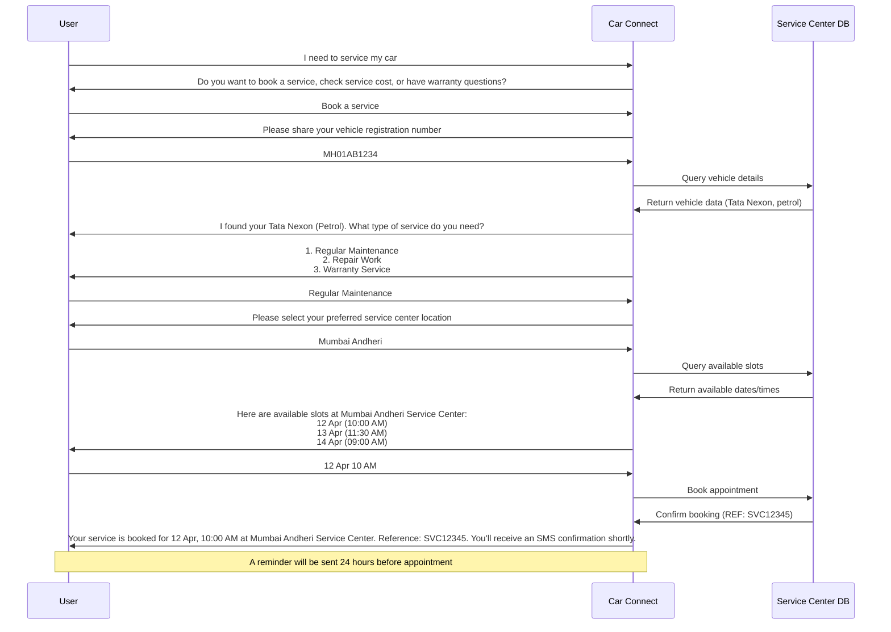
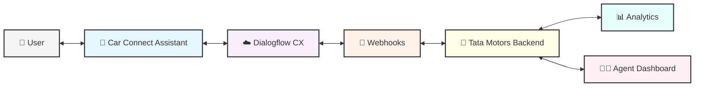

# Car-Connect-Virtual-Agent

# 🚗 Car Connect - Car Connect Virtual Assistant 🤖


## 📋 Overview

Car Connect is an interactive virtual assistant designed to enhance the customer experience for Tata Motors. This conversational AI agent helps users explore vehicle lineup, book test drives, schedule service appointments, find dealers, and more - all through a seamless, natural language interface.

## ✨ Key Features

| Feature | Description | Benefit |
|---------|-------------|---------|
| 🚘 **Explore Cars** | Browse and learn about motor vehicle lineup | Informed purchase decisions |
| 🔑 **Request Test Drive** | Schedule a test drive at your nearest dealership | Experience vehicles firsthand |
| 🛒 **Buy Now** | Direct links to purchase vehicles | Streamlined buying process |
| 🔧 **Explore Car Service** | Book appointments, calculate costs, access warranty info | Convenient maintenance management |
| 📍 **Find Dealer** | Locate the nearest sales showroom or service workshop | Easy access to physical locations |
| 📝 **Complaint and Feedback** | Submit complaints or provide feedback | Continuous service improvement |
| 🎮 **Play & Win Car** | Interactive game with promotional offers | Engaging customer experience |
| 📱 **My App** | Access Motors mobile app (iOS/Android) | On-the-go account management |

## 🚙 Supported Vehicle Models

<div align="center">

| Model | Type | Key Features |
|-------|------|-------------|
| **Nexon** | SUV | 💪 5-star safety, 🔋 EV option |
| **Safari** | SUV | 👨‍👩‍👧‍👦 7-seater, 🏔️ Off-road capability |
| **Harrier** | SUV | 🎯 Precision driving, 🌟 Premium features |
| **Punch** | Micro SUV | 🏙️ Urban mobility, 💰 Affordability |
| **Altroz** | Hatchback | 🛡️ 5-star safety, 🎵 Premium audio |
| **Tiago** | Hatchback | 🏆 Best-seller, 🔋 EV option |
| **Tigor** | Sedan | 💼 Spacious trunk, 📱 Connected features |
| **Curvv** | Concept | 🔮 Future design, 🔋 Next-gen EV |

</div>

## 🛠️ Technical Architecture

### Entity Types
- **🔢 car_no**: Vehicle registration number recognition (format: XX00XX0000)
- **⛽ fuel_type**: Supports EV, CNG, Petrol, and Diesel
- **🚐 model**: Eight models including Nexon, Safari, Harrier, Punch, etc.
- **⏱️ period**: Timeframe options (monthly, quarterly, yearly)
- **📮 pin_code**: Indian postal code validation

### AI Generators

<div align="center">

| Generator | Function | Implementation |
|-----------|----------|----------------|
| 💰 **Price Calculator** | Estimates service costs | Model + fuel type + service type |
| 🎁 **Coupon Generator** | Creates promotional codes | Algorithmic code generation |
| ⭐ **Rating Collection** | Gathers customer feedback | 5-point scale with comments |
| 🔢 **Reference ID** | Generates unique identifiers | Alphanumeric pattern generator |
| 📝 **Complaint Handler** | Manages customer issues | Priority-based routing system |

</div>

## 🔄 Conversation Flows

<div align="center">

### 🧠 Conversation Intelligence Layer

| Flow Type | NLP Capability | User Experience |
|-----------|---------------|-----------------|
| 🤔 **Intent Recognition** | Identifies user goals from natural language | Understands queries like "I want to test drive the Nexon" |
| 🔤 **Entity Extraction** | Identifies specific data points in user text | Captures car models, locations, dates |
| 🧩 **Context Management** | Maintains conversation history | Remembers previous selections |
| 🔄 **Flow Management** | Guides users through multi-step processes | Ensures complete information gathering |
| 🌐 **Multilingual Support** | Processes queries in multiple Indian languages | Regional language compatibility |

</div>

### 📱 Primary User Journeys

```mermaid
graph TD
    A[🏠 Welcome] --> B[📋 Main Menu]
    B --> C[🚘 Explore Cars]
    B --> D[🔑 Test Drive]
    B --> E[🛒 Buy Now]
    B --> F[🔧 Car Service]
    B --> G[📍 Find Dealer]
    B --> H[📝 Complaint/Feedback]
    B --> I[🎮 Play & Win]
    B --> J[📱 My App]
    
    %% Explore Cars Flow
    C --> C1[🚗 View Models]
    C --> C2[🔍 Compare Cars]
    C --> C3[💰 Check Pricing]
    C --> C4[🔋 Explore Features]
    C1 --> C5[📊 Car Specifications]
    C1 --> C6[🎨 Color Options]
    C1 --> C7[🧩 Variant Selector]
    C1 --> C8[💳 EMI Calculator]
    
    %% Test Drive Flow
    D --> D1[📅 Schedule Date/Time]
    D --> D2[📍 Select Location]
    D --> D3[🚙 Choose Vehicle]
    D1 --> D4[📋 Confirm Booking]
    D4 --> D5[📱 Get SMS Confirmation]
    
    %% Buy Now Flow
    E --> E1[💳 Online Booking]
    E --> E2[📞 Request Callback]
    E --> E3[📍 Visit Showroom]
    E1 --> E4[💰 Pay Booking Amount]
    E4 --> E5[🧾 Generate Receipt]
    E5 --> E6[📅 Schedule Delivery]
    
    %% Car Service Flow
    F --> F1[📅 Book Service]
    F --> F2[💲 Cost Calculator]
    F --> F3[📜 Warranty]
    F --> F4[❓ General Queries]
    F1 --> F1a[🔧 Service Type]
    F1 --> F1b[📆 Select Date/Time]
    F1 --> F1c[📍 Choose Service Center]
    F1 --> F1d[🚗 Enter Vehicle Details]
    F1c --> F1e[📋 Confirm Booking]
    F1e --> F1f[📲 Booking Confirmation]
    
    %% Find Dealer Flow
    G --> G1[🏪 Sales Showroom]
    G --> G2[🔨 Service Workshop]
    G1 --> G3[📍 Enter Location]
    G1 --> G4[📱 Share Contact]
    G3 --> G5[🗺️ View Map]
    G3 --> G6[📜 Show Dealer List]
    G6 --> G7[📞 Call Dealer]
    G6 --> G8[📧 Email Dealer]
    
    %% Complaint Flow
    H --> H1[⚠️ Raise Complaint]
    H --> H2[👨‍💼 Connect With Agent]
    H --> H3[⭐ Ask for Rating]
    H1 --> H4[🔢 Enter Reference ID]
    H1 --> H5[📝 Describe Issue]
    H1 --> H6[📷 Upload Photos]
    H5 --> H7[🎫 Get Ticket ID]
    H7 --> H8[📊 Track Status]

    %% Visual styling for nodes
    style A fill:#f9f9f9,stroke:#333,stroke-width:2px
    style B fill:#e6f7ff,stroke:#333,stroke-width:2px
    style C fill:#f0f9ff,stroke:#333,stroke-width:2px
    style D fill:#f3f0ff,stroke:#333,stroke-width:2px
    style E fill:#f6ffed,stroke:#333,stroke-width:2px
    style F fill:#fff0f6,stroke:#333,stroke-width:2px
    style G fill:#f6ffed,stroke:#333,stroke-width:2px
    style H fill:#fffbe6,stroke:#333,stroke-width:2px
    style I fill:#fff2e8,stroke:#333,stroke-width:2px
    style J fill:#f9f0ff,stroke:#333,stroke-width:2px
    
    %% Group styling
    classDef service fill:#fff0f6,stroke:#333,stroke-width:1px
    classDef dealer fill:#f6ffed,stroke:#333,stroke-width:1px
    classDef complaint fill:#fffbe6,stroke:#333,stroke-width:1px
    classDef explore fill:#f0f9ff,stroke:#333,stroke-width:1px
    classDef testdrive fill:#f3f0ff,stroke:#333,stroke-width:1px
    classDef buy fill:#f6ffed,stroke:#333,stroke-width:1px
    
    class F1,F1a,F1b,F1c,F1d,F1e,F1f,F2,F3,F4 service
    class G1,G2,G3,G4,G5,G6,G7,G8 dealer
    class H1,H2,H3,H4,H5,H6,H7,H8 complaint
    class C1,C2,C3,C4,C5,C6,C7,C8 explore
    class D1,D2,D3,D4,D5 testdrive
    class E1,E2,E3,E4,E5,E6 buy
```



### 📊 Conversation Analytics

<div align="center">

| Metric | Description | Business Value |
|--------|-------------|----------------|
| 🔍 **Intent Recognition Rate** | Accuracy of user intent identification | Measures AI understanding |
| 🧭 **Completion Rate** | % of conversations reaching a goal | Customer satisfaction indicator |
| ⏱️ **Resolution Time** | Average time to complete a user journey | Efficiency metric |
| 🔄 **Handoff Rate** | % of conversations requiring human agent | AI effectiveness measure |
| 📈 **Conversion Rate** | % of interactions leading to bookings/sales | Business impact |

</div>

### 🔍 Detailed Flow Examples

<div align="center">

#### 🚘 Explore Cars Flow



#### 🔧 Service Booking Flow



</div>

### 📱 Conversation Triggers and Entry Points

<div align="center">

| Entry Point | Trigger | Initial Flow |
|-------------|---------|--------------|
| 📲 **Mobile App** | App launch or button tap | Welcome → Main Menu |
| 🌐 **Website Widget** | Widget click or auto-popup | Welcome → Main Menu |
| 💬 **WhatsApp** | Message to business number | Welcome → Main Menu |
| 📞 **Call Center IVR** | Voice call to support | Welcome → Service options |
| 🔔 **Push Notification** | Notification tap | Targeted journey (Service/Offers) |
| 📧 **Email Link** | Email CTA button | Specific flow (based on campaign) |
| 🔊 **Voice Assistant** | Voice command activation | Welcome → Voice menu |

</div>

### 🧩 Fallback and Recovery Strategies

<div align="center">

| Scenario | Strategy | Example |
|----------|----------|---------|
| ❓ **Ambiguous Intent** | Clarifying questions | "Did you mean to book a service or check service history?" |
| 🔄 **Multiple Intents** | Intent prioritization | "I see you're asking about both pricing and features. Let's start with pricing." |
| 🤔 **Unknown Query** | Graceful fallback | "I'm not sure I understand. Would you like to explore cars, book a service, or find a dealer?" |
| 🔙 **Conversation Reset** | Easy restart options | "Type 'menu' anytime to return to the main options" |
| 👨‍💼 **Human Handoff** | Seamless agent transfer | "For this specialized query, I'll connect you with our expert team" |

</div>

## 🚀 Integration Platforms

<div align="center">

| Platform | Integration | User Experience |
|----------|-------------|----------------|
| 🌐 **Website** | Embedded widget | Seamless browsing experience |
| 📱 **Mobile App** | Native integration | On-the-go assistance |
| 💬 **WhatsApp** | Business API | Convenient messaging interface |
| 📞 **Call Center** | Voice response | Interactive voice guidance |
| 🤖 **Smart Speakers** | Voice commands | Hands-free operation |

</div>

## 💬 Example Interactions

> **Exploring Cars:**
> ```
> User: I want to explore Tata cars
> Bot: Select a car model:
>      - Tata Nexon
>      - Tata Harrier
>      - Tata Safari
>      - Tata Altroz
>      - Tata Tiago
>      - Tata Tigor
>      - Tata Punch
>      - Tata Curvv
> ```

> **Booking a Service:**
> ```
> User: I need to book a service
> Bot: Select a service:
>      - Regular Maintenance
>      - Repair
>      - Diagnostic Check
>      - Specialized Service
> 
> User: Regular Maintenance
> Bot: Enter your Car Model
> ...
> ```

## 📱 Mobile App Access

<div align="center">

| Platform | Store | Features |
|----------|-------|----------|
| 🍎 **iOS** | Apple App Store | Biometric login, Push notifications |
| 🤖 **Android** | Google Play Store | Material design, Widget support |

</div>

## 🔐 Security & Data Handling

<div align="center">

| Security Measure | Implementation | Benefit |
|-----------------|----------------|---------|
| 🛡️ **Data Protection** | End-to-end encryption | Customer information security |
| 🔒 **Compliance** | Industry standards | Legal requirements adherence |
| 🔑 **Transaction IDs** | Unique reference codes | Trackable customer interactions |

</div>

## 🔄 System Architecture



## 📞 Customer Support Escalation Path

1. 🤖 **Virtual Assistant** - First point of contact
2. 📋 **Automated Ticketing** - For tracked issues
3. 👨‍💼 **Live Agent** - For complex queries
4. 👨‍💻 **Technical Support** - For specialized assistance
5. 🧙‍♂️ **Senior Management** - For critical escalations

---

<div align="center">

*Developed for Tata Motors - Connecting Aspirations* ✨

</div>
